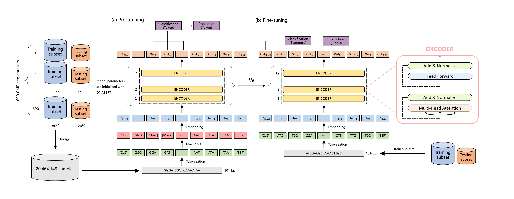

# TFBert




## Citation
If you have used TFBert in your research, please kindly cite the following publication:

Luo, H., Shan, W., Chen, C., Ding, P., & Luo, L. (2022). Improving language model of human genome for DNA–protein binding prediction based on task-specific pre-training. Interdisciplinary Sciences: Computational Life Sciences, 1-12.  DOI: 10.1007/s12539-022-00537-9   https://link.springer.com/article/10.1007/s12539-022-00537-9

## 1. Environment setup

We recommend you to build a python virtual environment with [Anaconda](https://docs.anaconda.com/anaconda/install/linux/). We applied training on a single NVIDIA Tesla V100 with 32 GB graphic memory. If you use GPU with other specifications and memory sizes, consider adjusting your batch size accordingly.

#### 1.1 Create and activate a new virtual environment

```
conda create -n tfbert python=3.6
conda activate tfbert
```

#### 1.2 Install the package and other requirements

(Required)

```
conda install pytorch torchvision cudatoolkit=10.0 -c pytorch
git clone https://github.com/lhy0322/TFBert
cd TFBert
python3 -m pip install --editable .
cd examples
python3 -m pip install -r requirements.txt
```
## 2. Download pre-trained model and datasets
#### 2.1 Pre-trained model
"examples/pre_model/checkpoint-20000.rar" is the pre-trained model with MLM training on the 690 ChIP-seq datasets.

"examples/pre_model/global-model.rar" is the global model with fine-tuning on the global-TR datasets.

#### 2.2 datasets
We retrieved the 690 [ChIP-seq datasets](http://cnn.csail.mit.edu/) collated by zeng et al.

## 3. Model pipeline
#### 3.1 Data processing
Use "pretrain-data.py" file to generate k-mer sequences files from 690 ChIP-seq datasets

#### 3.2 Train
The "run_individual.sh" corresponds to individual learning.

The "run_global.sh" corresponds to global learning.

The "run_transfer.sh" corresponds to transfer learning.

#### 3.3 Test
Use "run_predict.py" or

```
export KMER=3
export MODEL_PATH=result/individual/wgEncodeAwgTfbsBroadDnd41CtcfUniPk
export DATA_PATH=data_process_template/data/wgEncodeAwgTfbsBroadDnd41CtcfUniPk
export PREDICTION_PATH=predict/individual/wgEncodeAwgTfbsBroadDnd41CtcfUniPk

python TFBert.py \
    --model_type dna \
    --tokenizer_name=$MODEL_PATH/vocab.txt \
    --model_name_or_path $MODEL_PATH \
    --task_name dnaprom \
    --do_predict \
    --data_dir $DATA_PATH  \
    --max_seq_length 128 \
    --per_gpu_pred_batch_size=128   \
    --output_dir $MODEL_PATH \
    --predict_dir $PREDICTION_PATH \
    --n_process 12
```
## Reference
1. Ji Y, Zhou Z, Liu H, et al. DNABERT: pre-trained Bidirectional Encoder Representations from Transformers model for DNA-language in genome[J]. Bioinformatics, 2021, 37(15): 2112-2120.
